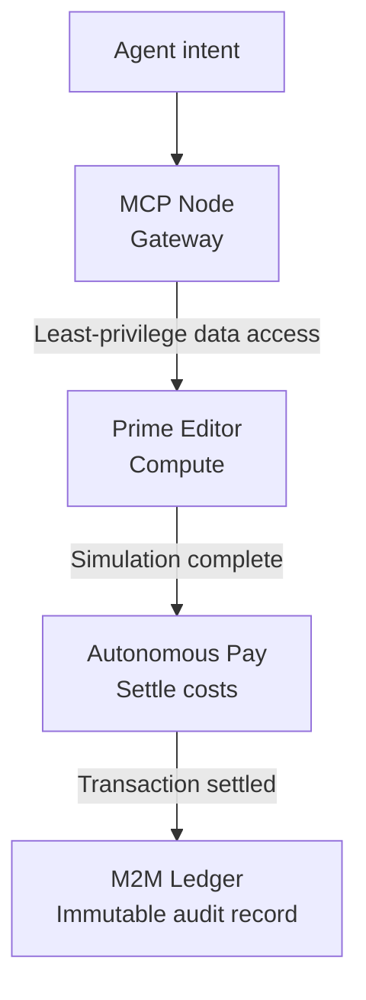

# TaskProxy Infrastructure Stack

A five-domain AI infrastructure concept portfolio, offered as a single acquisition package.

- Live demonstration: [taskproxy.ai](https://taskproxy.ai)
- Technical whitepaper: [taskproxy.ai/whitepaper.html](https://taskproxy.ai/whitepaper.html)
- Acquisition inquiries: [contact@taskproxy.ai](mailto:contact@taskproxy.ai)
- License: see [LICENSE](LICENSE)

## Current status

TaskProxy is a pre-revenue concept portfolio. It is not a production platform.

| Area | Status |
|---|---|
| Five live concept sites | Built and publicly accessible |
| MCP Node gateway | Demo layer implemented: request logging, node health checks and API key management. Full Model Context Protocol support is not yet built. |
| Genomic compute, payments, ledger | Browser-based simulations that illustrate the intended behavior |
| End-to-end workflow | Target architecture only. The nodes are not yet chained together. |

## The problem

Language models can reason about complex data, but few systems let autonomous agents act on it safely. A complete execution layer would need to let agents:

- Access sensitive data without over-exposure
- Run high-compute tasks such as genomic simulations
- Pay for compute in real time
- Produce verifiable audit records

TaskProxy frames this as the AI execution gap and proposes a four-node architecture to address it.

## Portfolio

| Domain | Role | Current implementation |
|---|---|---|
| [taskproxy.ai](https://taskproxy.ai) | Central hub: orchestration narrative and acquisition page | Concept site and whitepaper |
| [mcp-node.com](https://mcp-node.com) | Contextual gateway using the Model Context Protocol | Demo gateway with call logging, node health monitoring and a dashboard |
| [prime-editor.com](https://prime-editor.com) | Biologic compute node for genomic sequence modeling | Interactive visual simulation |
| [autonomous-pay.com](https://autonomous-pay.com) | Fiscal rail for machine-to-machine settlement | Simulated payment activity |
| [m2m-ledger.com](https://m2m-ledger.com) | Audit consensus layer | Simulated ledger activity |

## Architecture

The diagram shows the target architecture. It is not yet live end to end. Today, MCP Node sends status requests to the other nodes and records the results.

### Node responsibilities

- **MCP Node:** Translates agent intent into scoped, least-privilege requests so that agents use curated endpoints rather than raw data access.
- **Prime Editor:** An environment for modeling search-and-replace edits on digital DNA before any physical lab commitment.
- **Autonomous Pay:** Real-time fiscal authorization so the stack can pay for compute such as API calls, GPU time and server spin-up.
- **M2M Ledger:** An event record intended to give every handshake, simulation and payment a verifiable audit trail.

## Illustrative scenarios

These walkthroughs describe the intended design. They are not descriptions of current live behavior.

**Scenario A: genetic search-and-replace (business view).** An organization states what it wants through MCP Node. Prime Editor performs the modeling. Autonomous Pay covers the compute cost. M2M Ledger issues a record of every step.

**Scenario B: infrastructure compliance (technical view).**

1. MCP Node generates a just-in-time credential for a specific server directory.
2. The Prime Editor sandbox validates a patch against a shadow clone of the production environment.
3. Autonomous Pay settles the cost of the ephemeral server time.
4. M2M Ledger records the diff and transaction ID.

## Acquisition scope

The complete package is offered for **USD 150,000** and covers:

- All five domains
- The site source files and designs
- The demo gateway source (PHP) and database setup
- The technical whitepaper and concept documentation

The exact handover inventory is confirmed during the acquisition. This public repository contains documentation only. Application source is supplied separately as part of the agreed scope.

## Development opportunities

An acquirer would own a defined architecture and a working demonstration, and could build on it by:

- Implementing the full Model Context Protocol in MCP Node
- Replacing the simulated nodes with real compute, payment and ledger integrations
- Chaining the nodes into a single end-to-end workflow

Target sectors for a completed system include agentic AI infrastructure, computational biology, machine-to-machine payments and enterprise AI audit tooling.

## Glossary

| Term | Definition |
|---|---|
| Execution gap | The inability of AI agents to perform high-stakes tasks because secure and fiscal rails are missing |
| MCP | Model Context Protocol, an open standard for how AI agents access data sources and tools |
| JIT credential | A just-in-time access token created for one scoped operation and then revoked |
| M2M settlement | A machine-to-machine financial transaction with no human authorization step |
| Prime edit simulation | Digital modeling of DNA sequence changes such as insertions and deletions |

## Contact and license

Acquisition inquiries and requests for technical detail: [contact@taskproxy.ai](mailto:contact@taskproxy.ai)

Author: Jeret Christopher

This repository is proprietary. See [LICENSE](LICENSE) for terms.
